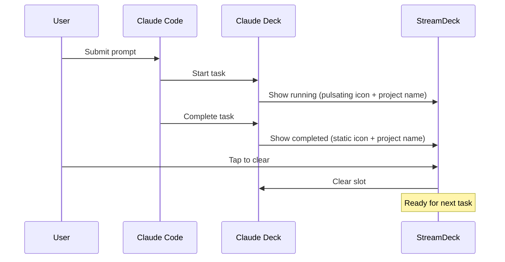

# Claude Deck

**Real-time visual feedback for your Claude Code sessions on Stream Deck**

Claude Deck is a Stream Deck plugin that provides visual feedback for your Claude Code development sessions. It automatically tracks when you're working with Claude and displays the status on your Stream Deck keys, giving you an at-a-glance view of your AI-assisted development workflow.

https://github.com/user-attachments/assets/a295d791-a16b-454b-bdf7-83aa4500e941

## ✨ Features

- **Visual Status Tracking**: See when Claude is working on your requests in real-time
- **Multiple Task Slots**: Track concurrent Claude tasks with project names displayed
- **Automatic Integration**: Seamlessly connects with Claude Code via hooks
- **Interactive Control**: Tap Stream Deck keys to clear completed tasks
- **Task Pool Management**: Automatically assigns new tasks to available slots
- **External API**: HTTP REST API for Claude Code integration

## 🎯 What Problem Does This Solve?

When working with Claude Code, it can be hard to track:
- Whether Claude is currently processing your request
- How many tasks Claude is working on simultaneously
- When a long-running task has completed
- The status of multiple concurrent development workflows

Claude Deck solves this by providing immediate visual feedback on your Stream Deck, turning it into a status dashboard for your Claude Code development workflow.

## ⚠️ Known Issues

### Claude Permission Interruptions Break Running State

If Claude is stopped mid-execution to ask for permission (e.g., to run a command or access a file), the indicator will show as "completed" even though Claude continues working after you grant permission.

**Details**: Claude asking for user action breaks the plugin's tracking because there are no hooks available in Claude Code to detect when work resumes after permission dialogs.
Hopefully hook system will be extended to support this scenario.

## 🔧 How It Works

Claude Deck consists of two main components:

1. **Stream Deck Plugin**: Displays service status on Stream Deck keys with animated progress indicators
2. **Claude Code Hooks**: Automatically start/stop tracking when you interact with Claude

### Integration Flow



The integration flow:
1. You submit a prompt to Claude Code
2. Claude hook automatically notifies Claude Deck
3. Claude Deck assigns a free Stream Deck slot and shows "running" status
4. When Claude finishes, the hook marks the task as completed
5. Stream Deck key shows completion status (static Claude icon in Claude colors)
6. Tap the key to clear it and free up the slot for new tasks

## 📋 Prerequisites

- **Stream Deck** (any model with programmable keys)
- **Claude Code CLI** installed and configured
- **Node.js** (for building the plugin and running hooks)
- **Stream Deck CLI tools** (for developer installation - install with `npm install -g @elgato/cli`)
- **Windows, macOS, or Linux**

## 🚀 Installation

Claude Deck requires two separate installations:
1. **Stream Deck Plugin** - The visual interface on your Stream Deck
2. **Claude Code Hooks** - The integration that notifies Claude Deck of your tasks

## Part 1: Stream Deck Plugin Installation

Choose one of the following installation methods:

### Option A: Developer Installation (Recommended for Development)

If you're developing or want to contribute to Claude Deck, use the automated setup scripts:

**Windows:**
```bash
git clone <repository-url>
cd claudedeck
npm install
setup.bat
```

**Linux/macOS:**
```bash
git clone <repository-url>
cd claudedeck
npm install
chmod +x setup.sh
./setup.sh
```

The setup scripts will:
- Build the plugin automatically
- Link it directly to Stream Deck for development
- Restart the Stream Deck software with the new plugin

### Option B: User Installation (Manual)

1. **Build the plugin:**
   ```bash
   git clone <repository-url>
   cd claudedeck
   npm install
   npm run build
   ```

2. **Install to Stream Deck:**
   ```bash
   # The plugin folder will be created at:
   # pro.clever.claudedeck.sdPlugin/
   
   # Copy this folder to your Stream Deck plugins directory:
   # Windows: %appdata%\Elgato\StreamDeck\Plugins\
   # macOS: ~/Library/Application Support/com.elgato.StreamDeck/Plugins/
   # Linux: ~/.local/share/StreamDeck/Plugins/
   ```

3. **Restart Stream Deck software**

4. **Add Claude Deck actions to your Stream Deck:**
   - Open Stream Deck software
   - Drag "Claude Deck > Session Slot" action to as many keys as you want to use for tracking tasks
   - Each key will display the project name when a task is running

5. **Start Claude Deck:**
   ```bash
   npm run watch
   ```
   
   Or build once and let Stream Deck run it:
   ```bash
   npm run build
   ```

6. **Verify the service is running:**
   ```bash
   curl http://localhost:17880/slots
   ```

## Part 2: Claude Code Hook Installation

**Important:** This is a separate installation process required for Claude Deck to work with Claude Code.

The hooks automatically notify Claude Deck when you start and finish Claude Code tasks.

1. **Copy the hook script to your Claude settings:**
   ```bash
   # Create hooks directory in your project
   mkdir -p /path/to/your/project/.claude/hooks
   
   # Copy the hook script
   cp .claude/hooks/claude-deck.js /path/to/your/project/.claude/hooks/
   
   # Or for global installation (tracks all projects):
   mkdir -p ~/.claude/hooks
   cp .claude/hooks/claude-deck.js ~/.claude/hooks/
   ```

2. **Configure the hooks in your Claude settings:**
   Add the following hooks to your `.claude/settings.local.json` file (create it if it doesn't exist):
   ```json
   {
     "hooks": {
       "UserPromptSubmit": [
         {
           "hooks": [
             {
               "type": "command",
               "command": "node .claude/hooks/claude-deck.js",
               "timeout": 5
             }
           ]
         }
       ],
       "Stop": [
         {
           "hooks": [
             {
               "type": "command",
               "command": "node .claude/hooks/claude-deck.js",
               "timeout": 5
             }
           ]
         }
       ],
       "Notification": [
         {
           "hooks": [
             {
               "type": "command",
               "command": "node .claude/hooks/claude-deck.js",
               "timeout": 5
             }
           ]
         }
       ]
     }
   }
   ```

3. **Configure your project name:**
   Edit `hooks/claude-deck.js` and change the `PROJECT_NAME` variable (line 8) to match your actual project name:
   ```javascript
   const PROJECT_NAME = 'YourProjectName';  // Change this to your project name
   ```
   This name will be displayed on the Stream Deck button when tasks are running.

4. **Test the hook installation: (optional)**
   ```bash
   # Copy and run the test script
   cp .claude/hooks/claude-deck.test.js /path/to/your/project/.claude/hooks/
   node .claude/hooks/claude-deck.test.js
   ```

## 📄 License

MIT License - see LICENSE file for details.
